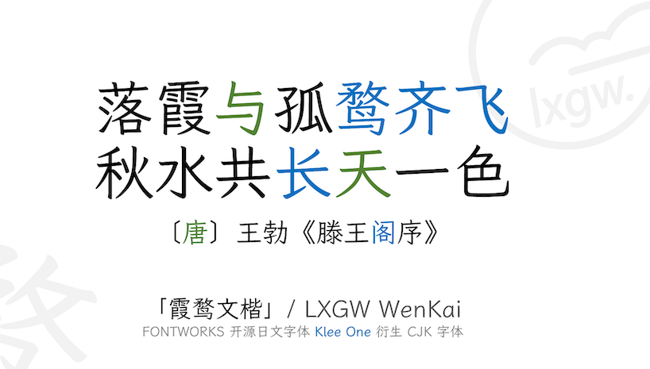
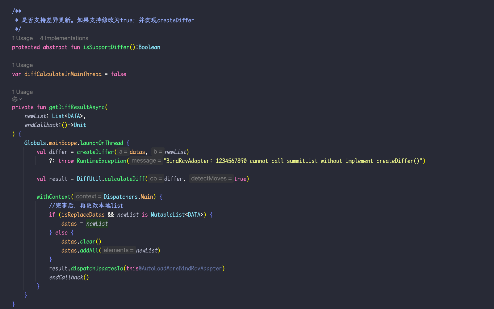
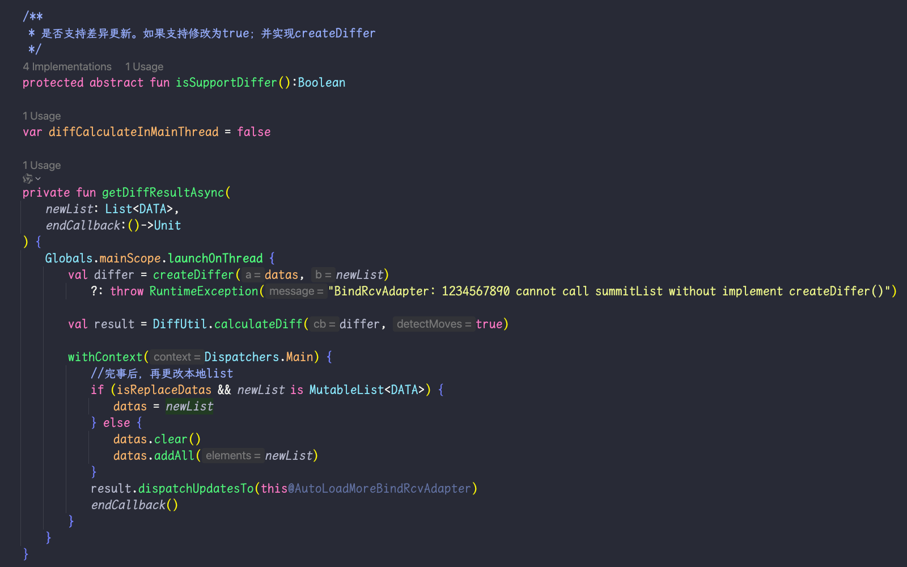

重要的事情先说：
**尊重原作者和开源精神，不要做任何违反开源精神的倒卖，仅限交流和个人使用！**

### 我做了什么
作为程序员，我发现LXGW原版mono版本，中文的排版看起来十分舒服，十分喜爱。

但是英文稍微显得窄了一些。于是对`0~9`, `a~z`,`A~Z`, 和英文`标点`，做了扩宽15%的处理。

这是原版在IDEA中的截图：

这是调整后，在IDEA中的截图：

现在看起来英文编码舒服多了。

请支持原作者。

### 原作者申明我强烈支持

> [!CAUTION]
>
> - 近来发现，包括本字体在内的众多开源字体、免费商用字体被淘宝、小红书等电商平台的某些商家倒卖，这种行为严重违反了 OFL 1.1 中对字体售卖行为的限制条款。如您遇到此类店铺贩售本字体，**请不要购买！** 否则，您所支付的钱财将**不会**流入字体作者手中，您也**不会**获得本字体的版本更新或其他支持。
> - 如果您发现了这个字体，想要推荐给您所在的单位使用，但该单位的法务认为必须要有「授权证明」，且不信任（或不承认）OFL 1.1 开源协议条款，那么强烈建议放弃使用本字体，选用免费商用且可开具「授权证明」的非开源字体，或者购买商业版权字体。
> - 鉴于国内各大手机厂商的主题商店仅对企业开放字体上传权限，少数对个人设计师开放字体权限的也需要版权登记证明（这里面涉及开源二创的著作权归属问题），如果您希望在手机主题商店上使用本字体，那么请您放下这个执念，选用默认字体或主题商店的版权字体。
> 

### LXGW WenKai / 霞鹜文楷 原字体预览

